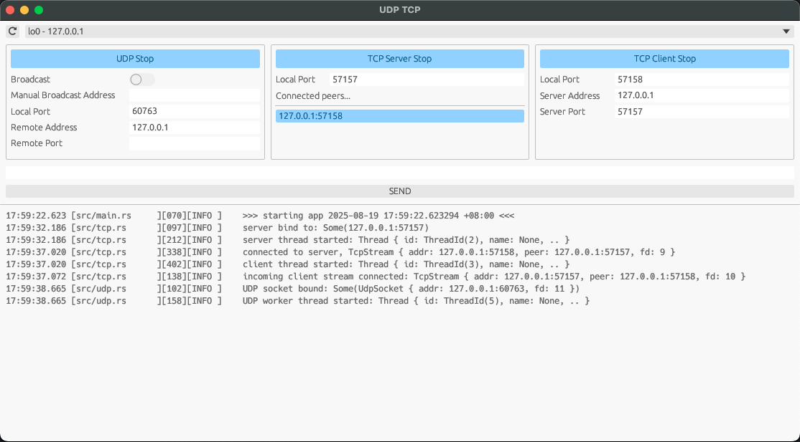

A GUI app written in RUST to study / demo how UDP and TCP works  
you can use this app when you want to listen to or send some traffic quickly to network



# Use the APP
## Build and run
rust compiler is needed to compile
run the app by double clicking the executable or
use the scripts to start / stop multiple instances
this by default starts 4 instances
```bash
./start_many.sh
./stop_many.sh
```

or use parameters
```bash
./start_many.sh [count]
./stop_many.sh
```
`count` should be >= 1  
in theory you can start as many instances as you wish (not tested)

by default the script builds the app in debug mode
to build in release mode use `--release` flag
```bash
./start_many.sh --release
./stop_many.sh
```

## Broadcast
- cannot broadcast on lookback (127.0.0.x) and INADDR_ANY (0.0.0.0)
- `Manual Broadcast Address` is used to override the default broadcast address (if valid and not empty)

# Some notes
the UDP broadcast feature is not fully tested  
sending raw bytes (eg. hex) is not supported now


